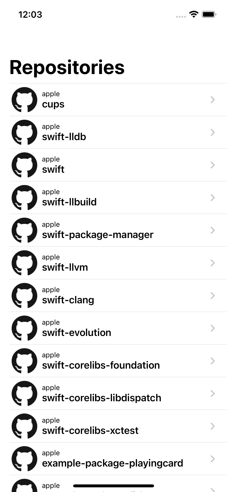

# GitHub Client
## Features
- Show repositories which owned by [Apple](https://github.com/apple)
- Show detail of each repository

## ScreenShots

## Training Textbook
[mixigroup/ios-swiftui-training](https://github.com/mixigroup/ios-swiftui-training)